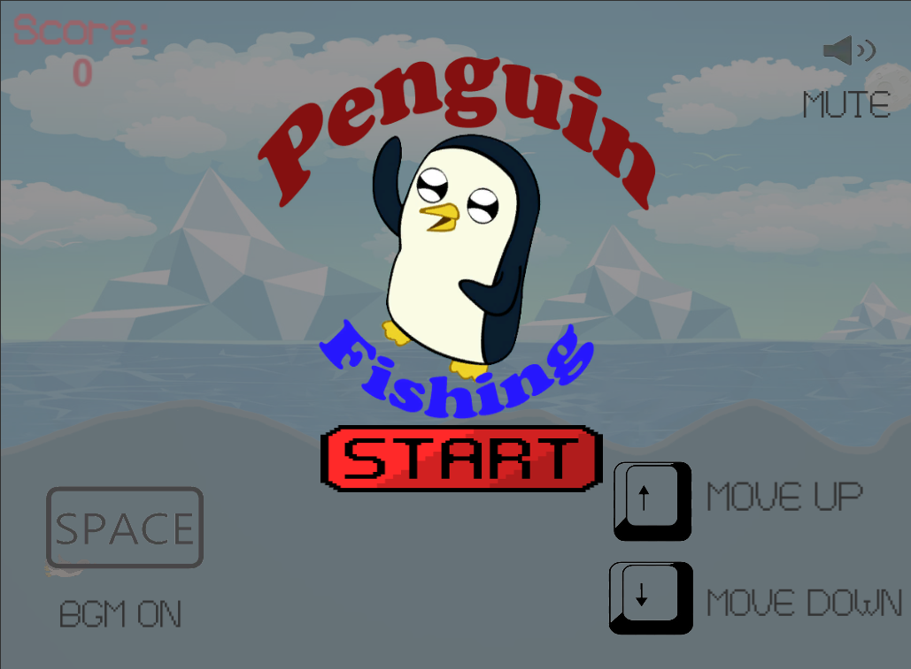
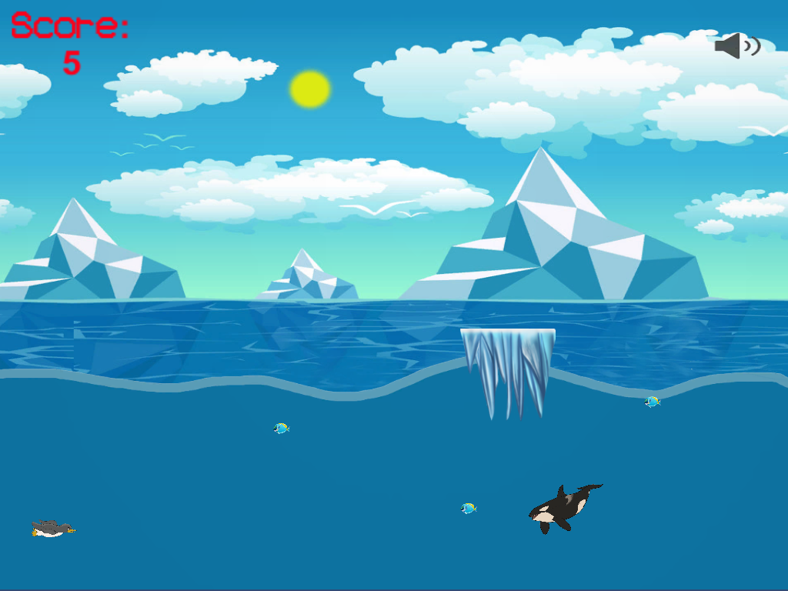

# Penguin-Project
Penguin Fishing - 2D arcade game created using the Unity engine  

The player can move the penguin up and down. We get a point for each caught fish.
As the points gained increase, the game speeds up. When the penguin hits the iceberg, he loses three points. 
The game ends when the penguin is eaten by killer whale.  
Below interface of this game

In folder Assets/script there are scripts from the project.  
Penguin fishing.exe is located in folder BuildGame.
